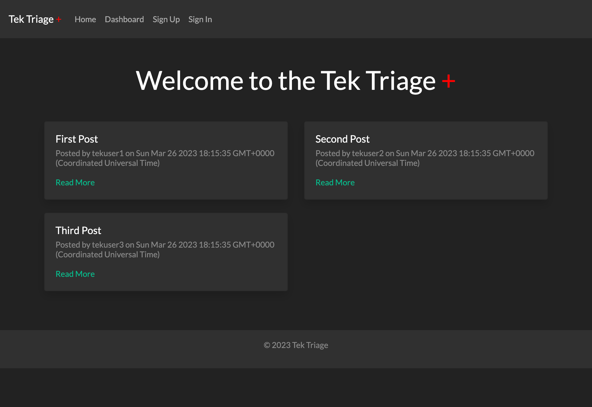

# TekTriage
      
## Description

TekTriage is a simple ticket submission website where users can post their computer problems and receive technical support. With an easy-to-use interface, users can submit a ticket and describe their issues, which will be reviewed by someone who will provide a solution. TekTriage provides an accessible and straightforward platform for users to get their computer problems solved.

## Table of Contents

- [Installation](#installation)
- [Usage](#usage)
- [Credits](#credits)
- [License](#license)

## Installation

- [Project repo](https://github.com/shaynefw/TekTriage)
- [Project deployed link](https://tektriage.herokuapp.com/)
- [Project Video Demo]()

## Usage

1. To read a specific blog post, click on view post. This will take you to a page with the full post and any accompanying media or comments.

2. If you'd like to leave a comment on a post, scroll down to the comment section at the bottom of the page and fill out the form with your name, email address, and comment.

3. If you'd like to create your own blog post, you'll need to create an account. To do this, click on the "Sign Up" link in the navigation menu and fill out the registration form with your name, email address, and a password.

4. Once you're logged in, click on the "New Post" link in the navigation menu to create a new blog post. You'll be prompted to enter a title, content, and any media you'd like to include.

5. When you're finished creating your post, click the "Publish" button to make it live on the site. Your post will now be visible to other users and they can leave comments on it.

6. You can also edit or delete your posts by clicking on the "My Posts" link in the navigation menu and selecting the post you'd like to edit or delete.

## Credits

Credits to my professor, instructors, classmates, and tutors for their invaluable support and guidance throughout my learning journey. Also to the developers of the various technologies used, including Google, documentation resources, and AI technologies that have provided valuable assistance and inspiration.

## License

MIT License

Copyright (c) 2023 Shayne Whayne

Permission is hereby granted, free of charge, to any person obtaining a copy
of this software and associated documentation files (the "Software"), to deal
in the Software without restriction, including without limitation the rights
to use, copy, modify, merge, publish, distribute, sublicense, and/or sell
copies of the Software, and to permit persons to whom the Software is
furnished to do so, subject to the following conditions:

The above copyright notice and this permission notice shall be included in all
copies or substantial portions of the Software.

THE SOFTWARE IS PROVIDED "AS IS", WITHOUT WARRANTY OF ANY KIND, EXPRESS OR
IMPLIED, INCLUDING BUT NOT LIMITED TO THE WARRANTIES OF MERCHANTABILITY,
FITNESS FOR A PARTICULAR PURPOSE AND NONINFRINGEMENT. IN NO EVENT SHALL THE
AUTHORS OR COPYRIGHT HOLDERS BE LIABLE FOR ANY CLAIM, DAMAGES OR OTHER
LIABILITY, WHETHER IN AN ACTION OF CONTRACT, TORT OR OTHERWISE, ARISING FROM,
OUT OF OR IN CONNECTION WITH THE SOFTWARE OR THE USE OR OTHER DEALINGS IN THE
SOFTWARE.

## Badges

## Features

## How to Contribute

## Tests

## Questions
  
If you have any questions you can reach me by...
  